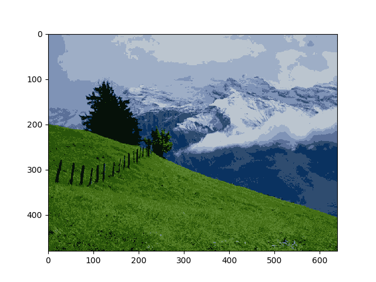

# K-means For Image Segmentation
A basic implementation of image segmentation with kmeans using Lloyd's algorithm, with random initialization

The following is a comparison of the result and the raw image:
Segmented image with k=200:  

Raw image:  

